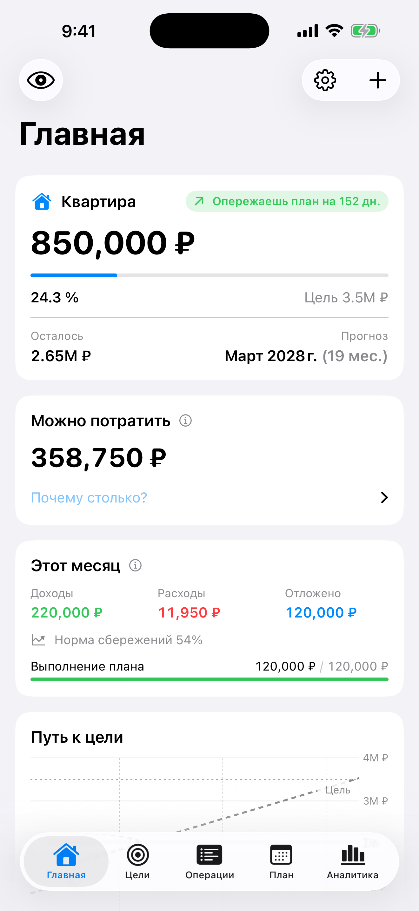
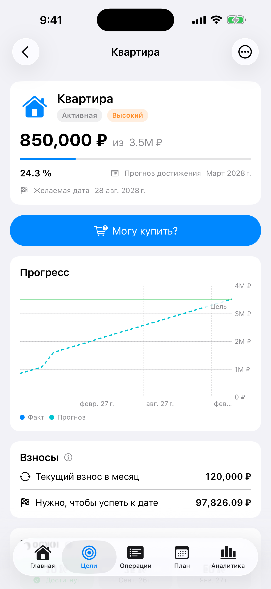
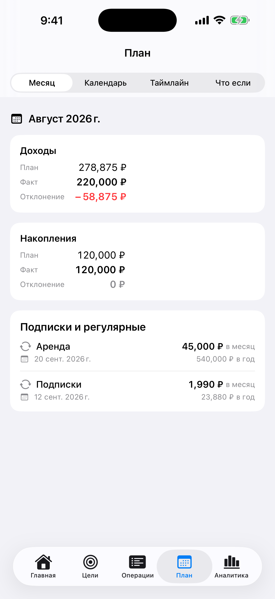
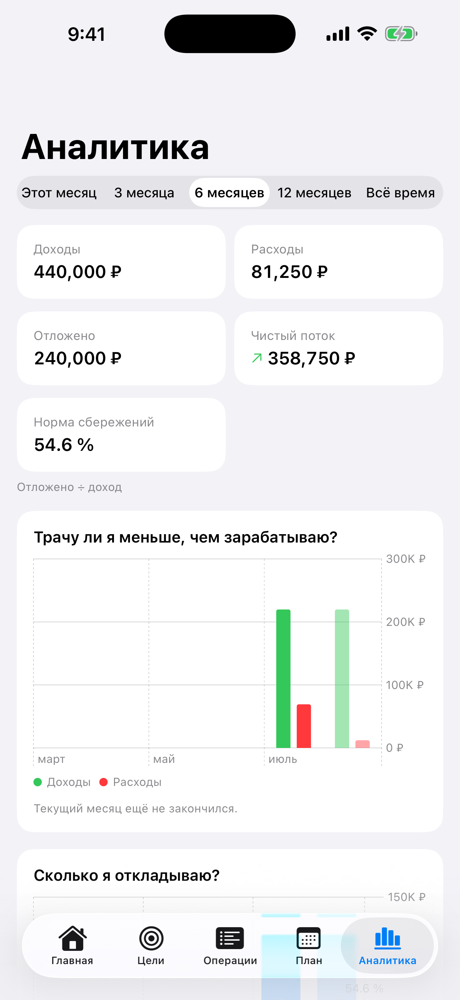
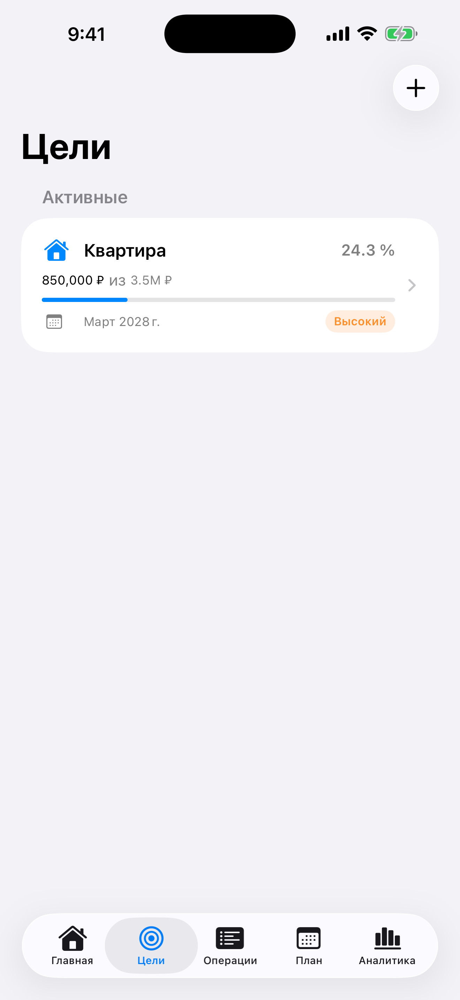

# FinPlan

A local-first personal financial planning app for goals, forecasting, budgeting and understanding the impact of today's financial decisions on future goals.

[](https://github.com/linkoln-1/FinPlan/actions/workflows/ci.yml)


[](LICENSE)

## Overview

FinPlan is an iPhone app that answers a different question than a typical expense tracker. Instead of only showing where money went, it shows where you are heading financially: when a goal will be reached at the current pace, how much is genuinely free to spend after reserves and upcoming bills, and how a specific purchase or a change in income would move the date of your goal.

Everything runs on the device. There is no account, no server and no network access — financial data never leaves the phone.

## Why this project exists

Most personal finance apps are excellent at recording the past and weak at reasoning about the future. FinPlan was built around a few convictions:

- A financial plan is a forecast, not a spreadsheet of categories. The core question is "will I make it, and by when?"
- Money math must be exact. Every amount is an integer number of minor units; there is no floating-point arithmetic anywhere in the calculation engines.
- Decisions should be simulated before they are made. "Can I buy this?" and "what if my income changes?" are first-class features, not afterthoughts.
- Financial data is sensitive. A planning tool should not need the cloud to be useful.

## Features

**Goals and forecasting**
- Financial goals with target amount, priority, optional desired date and an emergency-fund mode expressed in months of expenses.
- Month-by-month projection of the goal balance with the forecast completion date, standard percentage milestones (10 / 25 / 50 / 75 / 90 / 100 %) and round-amount milestones.
- Plan vs. actual: ahead / on track / behind, expressed both in money and in days, with a recovery plan (extra amount per month) when behind a desired date.
- Goal funding through explicit allocations from account balances, protected against allocating the same money twice.

**Decision tools**
- **Safe to Spend** — liquid balance minus goal reserves, upcoming mandatory payments before the next income and a minimum cash buffer, with a full breakdown of why the number is what it is.
- **Can I buy this?** — purchase impact simulation with a verdict (safe, delays goal, touches reserve, unaffordable), the new completion date and the delay in days.
- **What If** scenarios — change income share, monthly savings amount or percentage, planning exchange rate, monthly expenses, target amount or date, add one-time inflows or outflows, and compare the outcome against the base plan. Scenarios can be saved and reloaded.

**Money tracking**
- Income, expenses, transfers, currency exchanges and balance adjustments across multiple accounts (cash, checking, savings, investment, credit).
- Multi-currency with user-maintained planning exchange rates; explicit exchange fees that never hide inside balance differences.
- Split transactions across categories, tags, notes, search and filters.
- Recurring templates (daily, weekly, monthly, yearly, every N days) that generate planned transactions and a subscriptions overview with monthly and yearly equivalents.
- Expected one-time events (bonuses, payouts) with upcoming / overdue tracking and rescheduling.
- Plan calendar and timeline of upcoming inflows, outflows and goal milestones.

**Analytics**
- Monthly income, expenses and savings trends, savings rate, category and tag breakdowns, net-worth history.
- Category budgets with spending pace (on track / ahead / hot) and rollover policies.
- Runway: how many months of essential spending the free liquid balance covers.
- Insights (behind plan, overspending category, unusual spending, upcoming large payment, low runway, low safe-to-spend, currency deviation from planning rates, and more) and achievements.
- Monthly close with planned vs. actual variance.

**Platform integration**
- Home Screen widgets: primary goal progress, Safe to Spend, current month summary.
- App Intents and Siri Shortcuts: add expense, add income, check goal progress, check safe to spend, open primary goal.
- Local notifications for expected income, savings contributions, large upcoming payments and overdue events.
- Deep links (`finplan://dashboard`, `finplan://goals/<id>`, `finplan://transactions`, `finplan://plan`, `finplan://analytics`).

**Privacy and data**
- Face ID / device passcode app lock, hide-balances mode and an app-switcher privacy shield.
- JSON backup export and import (with validation and preview) and CSV export of transactions.
- English and Russian localization.

## Screenshots

Screenshots are taken from a synthetic demo dataset.

<table>
  <tr>
    <td></td>
    <td></td>
    <td></td>
  </tr>
  <tr>
    <td></td>
    <td></td>
    <td></td>
  </tr>
</table>

## Architecture

FinPlan is split into a pure Swift domain package and a SwiftUI application that consumes it.

```
Packages/FinPlanCore   pure Swift: money, domain types, calculation engines (no UI, no persistence)
        ▲
App/                   SwiftUI + SwiftData: persistence, features, services, App Intents
Widgets/               WidgetKit extension reading a JSON snapshot through the App Group
```

The rule that shapes everything: **views are not financial calculation authorities**. All money math lives in `FinPlanCore` as deterministic, tested functions; the app layer only assembles inputs and renders outputs. See [docs/ARCHITECTURE.md](docs/ARCHITECTURE.md).

## Technology

- Swift 6 with strict concurrency checking
- SwiftUI, SwiftData, Swift Charts, WidgetKit, App Intents, LocalAuthentication, UserNotifications
- Swift Testing for the domain package and app tests
- XcodeGen for project generation
- No third-party dependencies

## Requirements

- Xcode 26 or later
- Swift 6.0
- iOS 18.0 or later (iPhone)
- [XcodeGen](https://github.com/yonaskolb/XcodeGen) (`brew install xcodegen`)

## Getting Started

```bash
brew install xcodegen
git clone https://github.com/linkoln-1/FinPlan.git
cd FinPlan
xcodegen generate
open FinPlan.xcodeproj
```

Select the `FinPlan` scheme and an iPhone simulator, then build and run. The `.xcodeproj` is generated from `project.yml` and is not committed; regenerate it whenever `project.yml` changes.

To run on a physical device, set your own development team in Xcode's Signing & Capabilities (or in `project.yml`) and use a bundle identifier and App Group that belong to your team.

## Building

From the command line, with code signing disabled for the simulator:

```bash
xcodegen generate
xcodebuild -project FinPlan.xcodeproj -scheme FinPlan \
  -destination 'platform=iOS Simulator,name=iPhone 17' \
  CODE_SIGNING_ALLOWED=NO build
```

`scripts/ci.sh` runs the same steps as the CI workflow (domain tests, app build and app tests) and picks an available iPhone simulator automatically.

## Running Tests

Domain package — fast, no simulator required (199 tests):

```bash
cd Packages/FinPlanCore && swift test
```

Application target (`FinPlanTests`):

```bash
xcodebuild -project FinPlan.xcodeproj -scheme FinPlan \
  -destination 'platform=iOS Simulator,name=iPhone 17' \
  CODE_SIGNING_ALLOWED=NO test
```

## Project Structure

```
FinPlan/
├── project.yml                  XcodeGen project definition
├── App/
│   ├── FinPlanApp.swift         entry point
│   ├── RootView.swift           onboarding vs. main tabs, deep links
│   ├── AppRouter.swift          tab routing for widgets and intents
│   ├── AppIntents/              App Intents, Siri Shortcuts, intent entities
│   ├── Data/                    SwiftData models, FinanceStore, backup, widget snapshot
│   ├── DesignSystem/            cards, money text and fields, chart axes
│   ├── Features/
│   │   ├── Onboarding/
│   │   ├── Dashboard/
│   │   ├── Goals/
│   │   ├── Transactions/
│   │   ├── Plan/
│   │   ├── Analytics/
│   │   └── Settings/
│   ├── Services/                notifications, achievements
│   └── Resources/               assets, entitlements, String Catalog
├── AppTests/                    app-level smoke tests
├── Widgets/                     WidgetKit extension
├── Packages/FinPlanCore/
│   ├── Sources/FinPlanCore/
│   │   ├── Money/               Money, Currency, ExchangeRate
│   │   ├── Domain/              Account, Goal, TransactionRecord, IncomeSource, plan types
│   │   └── Engines/             Ledger, Projection, Scenario, SafeToSpend, PurchaseImpact,
│   │                            Budget, RecurringScheduler, Analytics, Insight
│   └── Tests/FinPlanCoreTests/
├── docs/
│   ├── ARCHITECTURE.md
│   ├── FINANCIAL_MODEL.md
│   ├── privacy-policy.md
│   └── appstore/                listing copy and demo screenshots
└── scripts/ci.sh
```

## Financial Correctness

The invariants below are enforced by `FinPlanCore` and covered by its test suite. The full description is in [docs/FINANCIAL_MODEL.md](docs/FINANCIAL_MODEL.md).

- Amounts are integer minor units (`Int64`) with `Int128` intermediates; there is no `Double` in any calculation.
- Exchange rates are scaled integers parsed from decimal strings without floating point.
- Rounding is half-away-from-zero; required contributions round up so a plan never undershoots.
- Transfers between own accounts and currency exchanges are neither income nor expense.
- Transfers and expenses tagged with a goal are savings, not spending.
- Planned and expected transactions never affect actual balances until completed.
- Fees are an explicit field attributed to a specific account, never inferred from balance differences.
- Two synthetic regression scenarios pin the projection engine to exact expected balances and completion cycles.

## Privacy

FinPlan is local-first: no network requests, no analytics, no advertising, no third-party SDKs. Data is stored in an on-device SwiftData store; widgets read a small snapshot through the App Group container. Face ID is handled by iOS and the app only learns whether authentication succeeded. See [PRIVACY.md](PRIVACY.md).

## Localization

English (source) and Russian, managed through Xcode String Catalogs (`Localizable.xcstrings`) in both the app and the widget extension. Money and dates are formatted with the user's locale.

## Accessibility

Interface text uses the system text styles, so Dynamic Type is respected throughout. Interactive controls, charts and money values carry VoiceOver labels, values and hints; decorative icons are hidden from assistive technologies.

## Roadmap

Not implemented yet:

- iCloud / CloudKit sync between devices
- Attachments UI (the domain model already carries attachment references)
- UI tests (XCUITest)

## Contributing

Contributions are welcome. Read [CONTRIBUTING.md](CONTRIBUTING.md) first. In short:

```
feature/* or fix/* branch  →  Pull Request  →  CI  →  merge into main
```

Direct pushes to `main` are not part of the workflow.

## Security

Please report vulnerabilities privately through GitHub's private vulnerability reporting rather than a public issue. Details are in [SECURITY.md](SECURITY.md).

## License

FinPlan is released under the MIT License. See [LICENSE](LICENSE).
